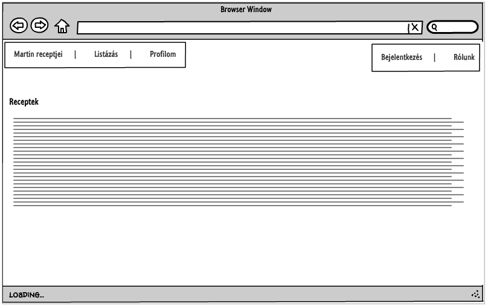
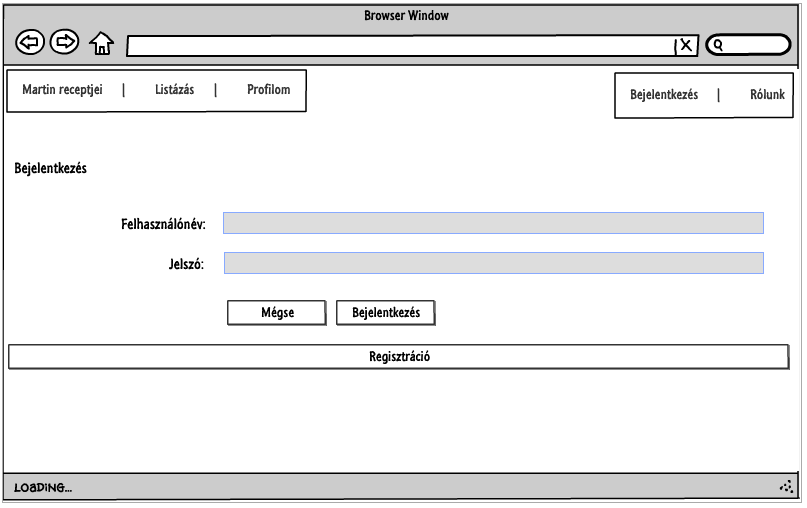
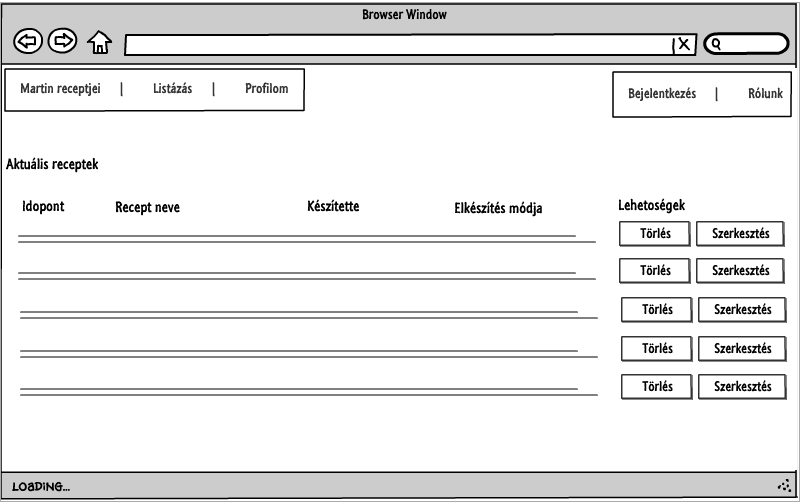
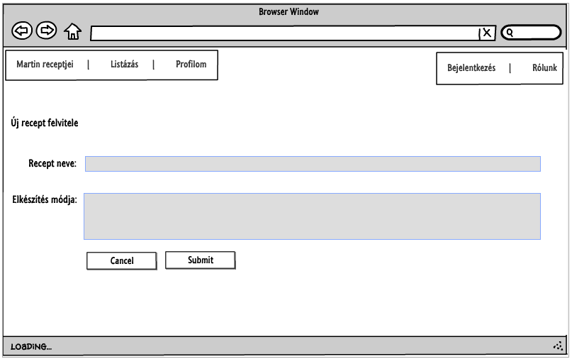
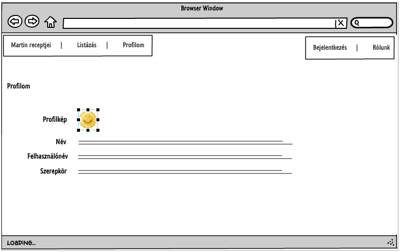
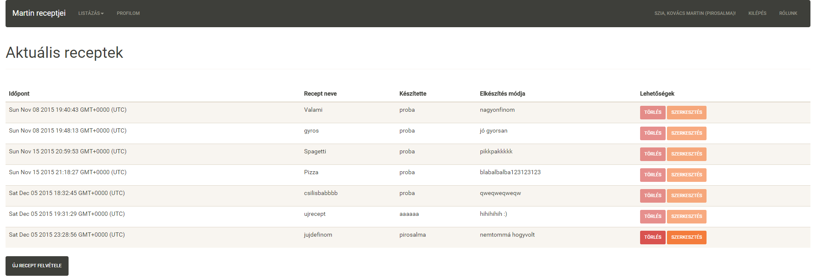
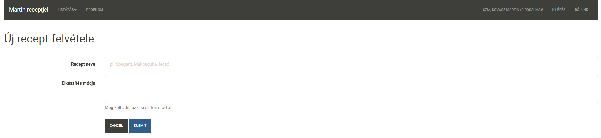

# Alkalmazások fejlesztése 1. beadandó feladat
# AOEGKK

## Követelményanalízis

### Funkcionális elvárások
    
+ Felhasználóként szeretnénk felvenni új receptet, hogy megosszuk azt a többiekkel.
+ Csak regisztrált felhasználók láthassák a recepteket.
+ Legyen lehetőség regisztrációra.
+ Legyen lehetőség bejelentkezésre.
+ Legyen lehetőség módosítani receptet.
+ Legyen lehetőség törölni receptet.

### Nem funkcionális elvárások

+ Felhasználóbarát, ergonomikus elrendezés és kinézet.
+ Gyors működés.
+ Biztonságos működés: jelszavak titkosított tárolás.
+ Állandó rendelkezésre állás (heroku)

### Szerepkörök

+ Vendég: Nem bejelentkezett felhasználó, láthatja a főaldalat, a bejelentkezés és regisztrációt.
+ User: Listázhatja a saját/összes recepteket, tudja törölni és szerkeszteni a sajátjait.
+ Admin: Hasonló a User-hez, de mindenkiét tudja szerkeszteni és törölni.

**Használati eset diagram**

**Új recept felvitele folyamat diagram**

## Tervezés

### Oldaltérkép

Látogatóknak:
+ Főoldal
+ Bejelentkezés
+ Regisztráció

Felhasználóknak:
+ Főoldal
+ Login/Logout
+ Receptek listája
    + Új recept
    + Saját recept szerkesztése
    + saját recept törlése

Admin:
+ Főoldal
+ Login/Logout
+ Receptek listája
    + Új recept
    + Bármely recept szerkesztése
    + Bármely recept törlése
	
### Végpontok

+ GET / - főoldal, üdvözlő képernyő
+ GET /logout - kijelentkezés
+ GET /about - rövid ismertető
+ GET /profile - saját profil megtekintése
+ GET /login - bejelentkező oldal
+ POST /login - bejelentkezési adatok felküldése
+ GET /login/signup - regisztációs oldal
+ POST /login/sugnup - regisztációs adatok felküldése
+ GET /recipes/list - receptek lista oldal
+ GET /recipes/list - saját receptek lista oldal
+ GET /recipes/new - új recept oldal
+ POST /recipes/new - új recept felvitele
+ GET /recipes/delete/:id - recept törlése
+ GET /recipes/edit/:id - recept szerkesztése
+ POST /recipes/edit:id - recept szerkesztésének felküldése
 
### Oldalvázlatok

**Főoldal**

**Bejelentkezés oldal**

**Receptek listaoldal**

**Új recept létrehozása**

**Profil oldal**

### Designtervek

**Receptek listaoldal design számítógépen**

**Új recept design számítógépen**

A design megvalósítása Bootstrap segítségével történt a reszponzív felület elérésének könnyű kezelése érdekében. A weboldal többi oldalára is hasonló elrendezések érvényesek.

## Adatmodell

## Implementáció

### Fejlesztői környezet

https://ide.c9.io/pirosalma/beadando1

Cloud9 IDE egy ingyenes, integrált online fejlesztői környezet. Több száz programozási nyelvet támogat pl.: PHP, JavaScript, Node.js. A fejlesztők egy online virtuális linux gépen dolgozhatnak, ugyanazon a projecten akár egyszerre többen is. Az elkészült kódot azonnal lehet futtatni, rendelkezik böngészőtámogatással.

A virtuális gép adatai:

+ 1 CPU mag
+ 512 MB memória
+ 1 GB HDD

### Könyvtárstruktúrában lévő mappák funkiójának bemutatása

+ Root: Tartalmazza a telepítésekhez szükséges bower.json és package.json fájlokat, valamint a futtatható server.js fájlt.
+ bower_components: Kliens oldali függőségek ide töltődnek le.
+ config: Tartalmazza az waterline.js (sails.js) ORM konfigurációs fájlát.
+ controllers: Az egyes oldalak funkcióit implementáló fájlokat (végpontokat) tartalmazza.
+ docs/images: Tartalmazza a dokumentációhoz tartozó képeket.
+ models: Az applikáció modelljei, melyekkel dolgozunk az oldalon.
+ node_modules: Tartalmazza a Node.js működését kiegészítő packageket. (middlewarek)
+ views: Tartalmazza a megjelenítendő oldalakat leíró handlebars fájlokat.
+ test: Tartalmazza a teszteket.

## Felhasználói dokumentáció

### A futtatáshoz ajánlott hardver-, szoftver konfiguráció

Hardver szinten az ajánlott követelmény megegyezik a fejlesztői környezet specifikációival.

A weboldal bármilyen HTML5-t támogató böngészőben megjeleníthető és használható.

### Telepítés

A teljes weboldal megtalálható a http://asdbeadando1.herokuapp.com/ webdoldalon.

Ha mégis saját gépen szeretné futtatni az alkalmazást, akkor a GIT Repository jobb oldalán található Download ZIP gombra kattintva a teljes project letölthető tömörítve.

### A program használata

A http://asdbeadando1.herokuapp.com/ weboldalra navigálva láthatunk egy üdvözlő szöveget.

A képernyő jobb-felső sarkában található **Bejelentkezés** gombra kattintva elérhető a bejelentkezési felület.

Itt több választásunk is van:

+ Bejelentkezhetünk már meglévő felhasználói nevünkkel és jelszavunkkal (ha már van).
+ A Regisztráció gombra kattintva regisztrálhatunk az oldalra.

A regisztrációs oldalon minden mező kötelezően kitöltendő, kivéve az avatar. Kitöltés után az **ELKÜLD** gombra kattintva végleges a regisztráció.

Későbbiekben az itt megadott adatokkal tudunk majd bejelentkezni. Most, át lettünk irányítva a receptek listájának oldalára.

Itt láthatjuk az eddig felvitt recepteket.

Az új recept felvitele gombra kattintva vehetünk fel új receptet.

Minden mező kitöltése kötelező, a **MENTÉS** gombra kattintva elmenthetjük a receptet.

Ekkor visszatérünk ismét a rececptek oldalára és láthatjuk a frissen felvett receptet. A recept jobb oldalán található két gomb **SZERKESZTÉS** és **TÖRLÉS**.

A **SZERKESZTÉS** gombra kattintva a már előbb megismert új recept oldalhoz hasonló odlalra kerülünk, ahol szerkeszthetjük a recept adatait.

A **TÖRÖL** gombra kattintva törölhetjük az adott receptet.

Ha már nem szeretnénk több dolgot csinálni a honlapon, a jobb felsős sarokban található **KILÉPÉS** gombra kattintva kiléphetünk az oldalról.

